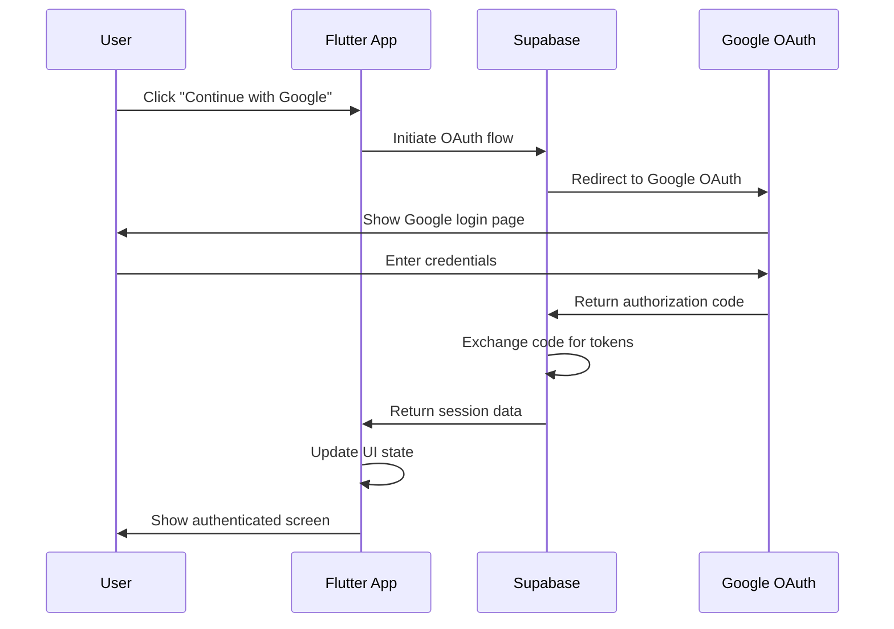
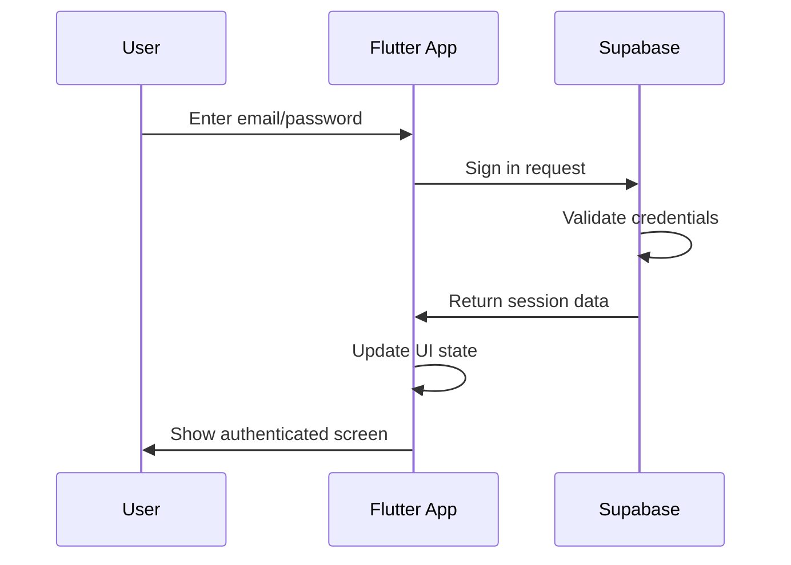

# DuoTask - Comprehensive Documentation

## 📋 Table of Contents
1. [Project Overview](#project-overview)
2. [Features](#features)
3. [Architecture](#architecture)
4. [Design Decisions](#design-decisions)
5. [Technical Stack](#technical-stack)
6. [Configuration Settings](#configuration-settings)
7. [Database Schema](#database-schema)
8. [Authentication Flow](#authentication-flow)
9. [Development Setup](#development-setup)
10. [Deployment Guide](#deployment-guide)
11. [Troubleshooting](#troubleshooting)
12. [Future Roadmap](#future-roadmap)

---

## 🎯 Project Overview

**DuoTask** is a Flutter-based task management application designed specifically for couples and partners. The app enables users to create, share, and manage tasks together, fostering collaboration and accountability in relationships.

### Core Concept
- **Shared Task Management:** Partners can create and assign tasks to each other
- **Real-time Collaboration:** Live updates when tasks are created, completed, or modified
- **Pairing System:** Unique pairing codes to connect partners securely
- **Cross-platform:** Works on Web, iOS, and Android

---

## ✨ Features

### ✅ Implemented Features

#### Authentication
- **Google OAuth Integration:** Seamless sign-in with Google accounts
- **Email/Password Authentication:** Traditional email-based registration and login
- **Automatic Session Management:** Persistent login sessions
- **Secure Token Handling:** JWT tokens managed by Supabase

#### User Management
- **User Profiles:** Basic user information storage
- **Pairing System:** Unique 8-character pairing codes for partner connection
- **Partner Linking:** Secure partner-to-partner task sharing

#### Task Management
- **Task Creation:** Add new tasks with titles, descriptions, and due dates
- **Task Assignment:** Assign tasks to yourself or your partner
- **Task Status Tracking:** Mark tasks as pending, in progress, or completed
- **Due Date Management:** Set and track task deadlines

#### Real-time Features
- **Live Updates:** Real-time task synchronization between partners
- **Instant Notifications:** Immediate updates when tasks are modified
- **Offline Support:** Basic offline functionality with sync on reconnection

### 🚧 Planned Features

#### Enhanced Task Management
- **Task Categories:** Organize tasks by categories (chores, dates, work, etc.)
- **Task Priority Levels:** High, medium, low priority system
- **Recurring Tasks:** Daily, weekly, monthly recurring task support
- **Task Templates:** Pre-defined task templates for common activities

#### Communication Features
- **In-app Messaging:** Direct messaging between partners
- **Task Comments:** Add comments and notes to tasks
- **Reaction System:** Emoji reactions to task completions

#### Advanced Features
- **Task Analytics:** Progress tracking and completion statistics
- **Reminder System:** Push notifications for upcoming deadlines
- **Calendar Integration:** Sync with device calendars
- **File Attachments:** Attach images and documents to tasks

---

## 🏗️ Architecture

### High-Level Architecture
```
┌─────────────────┐    ┌─────────────────┐    ┌─────────────────┐
│   Flutter App   │    │   Supabase      │    │   Google OAuth  │
│   (Frontend)    │◄──►│   (Backend)     │◄──►│   (Auth)        │
└─────────────────┘    └─────────────────┘    └─────────────────┘
         │                       │
         │                       │
         ▼                       ▼
┌─────────────────┐    ┌─────────────────┐
│   Real-time     │    │   PostgreSQL    │
│   WebSocket     │    │   Database      │
└─────────────────┘    └─────────────────┘
```

### Component Architecture

#### Frontend (Flutter)
- **State Management:** Built-in Flutter state management
- **UI Framework:** Material Design 3
- **Navigation:** Flutter Navigator 2.0
- **HTTP Client:** Supabase Flutter SDK

#### Backend (Supabase)
- **Database:** PostgreSQL with Row Level Security (RLS)
- **Authentication:** Supabase Auth with OAuth providers
- **Real-time:** WebSocket-based real-time subscriptions
- **Storage:** Supabase Storage for file attachments
- **Edge Functions:** Serverless functions for complex operations

#### External Services
- **Google OAuth:** Authentication provider
- **Firebase:** Push notifications (planned)
- **Cloud Storage:** File storage and CDN

---

## 🎨 Design Decisions

### UI/UX Design Principles

#### 1. **Simplicity First**
- Clean, minimal interface
- Intuitive navigation
- Reduced cognitive load
- Focus on core functionality

#### 2. **Partner-Centric Design**
- Shared task views
- Partner avatars and names
- Collaborative interaction patterns
- Relationship-focused terminology

#### 3. **Accessibility**
- High contrast ratios
- Scalable text sizes
- Screen reader support
- Keyboard navigation

#### 4. **Cross-Platform Consistency**
- Material Design 3 guidelines
- Platform-specific adaptations
- Responsive design
- Touch-friendly interactions

### Color Scheme
```dart
// Primary Colors
Primary: #2196F3 (Blue)
Primary Dark: #1976D2
Primary Light: #BBDEFB

// Secondary Colors
Secondary: #FF4081 (Pink)
Secondary Dark: #C51162
Secondary Light: #FF80AB

// Neutral Colors
Background: #FFFFFF
Surface: #F5F5F5
Text Primary: #212121
Text Secondary: #757575
```

### Typography
```dart
// Headlines
Headline Large: Roboto, 32sp, Bold
Headline Medium: Roboto, 28sp, Medium
Headline Small: Roboto, 24sp, Medium

// Body Text
Body Large: Roboto, 16sp, Regular
Body Medium: Roboto, 14sp, Regular
Body Small: Roboto, 12sp, Regular
```

---

## 🔧 Technical Stack

### Frontend Technologies
- **Framework:** Flutter 3.0+
- **Language:** Dart 3.0+
- **UI Library:** Material Design 3
- **State Management:** Flutter StatefulWidget
- **HTTP Client:** Supabase Flutter SDK
- **Local Storage:** SharedPreferences (planned)

### Backend Technologies
- **Platform:** Supabase
- **Database:** PostgreSQL 15+
- **Authentication:** Supabase Auth
- **Real-time:** WebSocket subscriptions
- **Storage:** Supabase Storage
- **Edge Functions:** Deno runtime

### Development Tools
- **IDE:** VS Code / Android Studio
- **Version Control:** Git
- **Package Manager:** Flutter Pub
- **Build Tools:** Flutter CLI
- **Testing:** Flutter Test

### External Services
- **OAuth Provider:** Google OAuth 2.0
- **Push Notifications:** Firebase Cloud Messaging (planned)
- **Analytics:** Firebase Analytics (planned)
- **Crash Reporting:** Firebase Crashlytics (planned)

---

## ⚙️ Configuration Settings

### Environment Variables (.env)
```bash
# Supabase Configuration
SUPABASE_URL=https://your-project.supabase.co
SUPABASE_ANON_KEY=your-anon-key-here

# Google OAuth Configuration
GOOGLE_WEB_CLIENT_ID=your-web-client-id.apps.googleusercontent.com
GOOGLE_IOS_CLIENT_ID=your-ios-client-id.apps.googleusercontent.com
GOOGLE_ANDROID_CLIENT_ID=your-android-client-id.apps.googleusercontent.com

# App Configuration
APP_NAME=DuoTask
APP_VERSION=1.0.0
DEBUG_MODE=true
```

### Supabase Dashboard Settings

#### Authentication Settings
- **Site URL:** `http://localhost:5000` (development)
- **Redirect URLs:** 
  - `http://localhost:5000`
  - `http://localhost:5000/`
  - `https://your-domain.com` (production)
- **JWT Expiry:** 3600 seconds (1 hour)
- **Refresh Token Rotation:** Enabled

#### OAuth Providers
- **Google:** Enabled
  - Client ID: Your Google OAuth client ID
  - Client Secret: Your Google OAuth client secret
  - Redirect URL: `https://your-project.supabase.co/auth/v1/callback`

#### Row Level Security (RLS)
```sql
-- Enable RLS on all tables
ALTER TABLE usr ENABLE ROW LEVEL SECURITY;
ALTER TABLE tasks ENABLE ROW LEVEL SECURITY;
ALTER TABLE pairings ENABLE ROW LEVEL SECURITY;
```

### Google Cloud Console Settings

#### OAuth 2.0 Client Configuration
- **Application Type:** Web application
- **Authorized JavaScript origins:**
  - `http://localhost:5000`
  - `https://your-domain.com`
- **Authorized redirect URIs:**
  - `http://localhost:5000`
  - `https://your-project.supabase.co/auth/v1/callback`

#### API Configuration
- **Google+ API:** Enabled
- **Google People API:** Enabled (for profile data)
- **Google Calendar API:** Enabled (planned)

---

## 🗄️ Database Schema

### Users Table (usr)
```sql
CREATE TABLE usr (
    id UUID PRIMARY KEY DEFAULT gen_random_uuid(),
    email VARCHAR(255) UNIQUE NOT NULL,
    name VARCHAR(255) NOT NULL,
    pair_code VARCHAR(8) UNIQUE NOT NULL,
    paired_with UUID REFERENCES usr(id),
    created_at TIMESTAMP WITH TIME ZONE DEFAULT NOW(),
    updated_at TIMESTAMP WITH TIME ZONE DEFAULT NOW()
);
```

### Tasks Table (tasks)
```sql
CREATE TABLE tasks (
    id UUID PRIMARY KEY DEFAULT gen_random_uuid(),
    title VARCHAR(255) NOT NULL,
    description TEXT,
    user_id UUID REFERENCES usr(id) NOT NULL,
    partner_id UUID REFERENCES usr(id),
    status VARCHAR(20) DEFAULT 'pending' CHECK (status IN ('pending', 'in_progress', 'completed')),
    priority VARCHAR(20) DEFAULT 'medium' CHECK (priority IN ('low', 'medium', 'high')),
    due_date TIMESTAMP WITH TIME ZONE,
    created_at TIMESTAMP WITH TIME ZONE DEFAULT NOW(),
    updated_at TIMESTAMP WITH TIME ZONE DEFAULT NOW()
);
```

### Pairings Table (pairings)
```sql
CREATE TABLE pairings (
    id UUID PRIMARY KEY DEFAULT gen_random_uuid(),
    user1_id UUID REFERENCES usr(id) NOT NULL,
    user2_id UUID REFERENCES usr(id) NOT NULL,
    status VARCHAR(20) DEFAULT 'pending' CHECK (status IN ('pending', 'accepted', 'rejected')),
    created_at TIMESTAMP WITH TIME ZONE DEFAULT NOW(),
    updated_at TIMESTAMP WITH TIME ZONE DEFAULT NOW(),
    UNIQUE(user1_id, user2_id)
);
```

### Row Level Security Policies

#### Users Table Policies
```sql
-- Users can read their own profile
CREATE POLICY "Users can view own profile" ON usr
    FOR SELECT USING (auth.uid() = id);

-- Users can update their own profile
CREATE POLICY "Users can update own profile" ON usr
    FOR UPDATE USING (auth.uid() = id);

-- Users can read their partner's profile
CREATE POLICY "Users can view partner profile" ON usr
    FOR SELECT USING (
        auth.uid() = id OR 
        auth.uid() = paired_with OR 
        id = (SELECT paired_with FROM usr WHERE id = auth.uid())
    );
```

#### Tasks Table Policies
```sql
-- Users can read their own tasks and partner's tasks
CREATE POLICY "Users can view own and partner tasks" ON tasks
    FOR SELECT USING (
        user_id = auth.uid() OR 
        partner_id = auth.uid() OR
        user_id = (SELECT paired_with FROM usr WHERE id = auth.uid()) OR
        partner_id = (SELECT paired_with FROM usr WHERE id = auth.uid())
    );

-- Users can create tasks
CREATE POLICY "Users can create tasks" ON tasks
    FOR INSERT WITH CHECK (user_id = auth.uid());

-- Users can update their own tasks
CREATE POLICY "Users can update own tasks" ON tasks
    FOR UPDATE USING (user_id = auth.uid());
```

---

## 🔐 Authentication Flow

### Google OAuth Flow


### Email/Password Flow


### Session Management
- **Access Token:** JWT token with 1-hour expiry
- **Refresh Token:** Long-lived token for session renewal
- **Automatic Refresh:** SDK handles token refresh automatically
- **Persistent Sessions:** Sessions persist across app restarts

---

## 🛠️ Development Setup

### Prerequisites
```bash
# Required Software
- Flutter SDK 3.0.0+
- Dart SDK 3.0.0+
- Android Studio / VS Code
- Git
- Chrome (for web development)
- Xcode (for iOS development)
- Android Studio (for Android development)
```

### Installation Steps
```bash
# 1. Clone the repository
git clone <repository-url>
cd task_bubble

# 2. Install dependencies
flutter pub get

# 3. Create environment file
cp .env.example .env
# Edit .env with your credentials

# 4. Run the app
flutter run -d chrome --web-port 5000
```

### Development Commands
```bash
# Run on different platforms
flutter run -d chrome --web-port 5000  # Web
flutter run -d ios                     # iOS Simulator
flutter run -d android                 # Android Emulator

# Build for production
flutter build web                      # Web build
flutter build ios                      # iOS build
flutter build apk                      # Android APK
flutter build appbundle                # Android App Bundle

# Testing
flutter test                           # Run tests
flutter test --coverage                # Run tests with coverage

# Code Analysis
flutter analyze                        # Static analysis
flutter format .                       # Code formatting
```

### Project Structure
```
task_bubble/
├── lib/
│   ├── main.dart                     # App entry point
│   ├── screens/                      # UI screens
│   │   ├── auth_screen.dart          # Authentication screen
│   │   ├── task_screen.dart          # Task management screen
│   │   └── pairing_screen.dart       # Partner pairing screen
│   ├── services/                     # Business logic
│   │   ├── auth_service.dart         # Authentication service
│   │   ├── task_service.dart         # Task management service
│   │   └── pairing_service.dart      # Partner pairing service
│   ├── models/                       # Data models
│   │   ├── task.dart                 # Task model
│   │   └── user.dart                 # User model
│   └── widgets/                      # Reusable widgets
│       └── task_bubble.dart          # Task display widget
├── android/                          # Android-specific files
├── ios/                              # iOS-specific files
├── web/                              # Web-specific files
├── test/                             # Test files
├── pubspec.yaml                      # Dependencies
├── .env                              # Environment variables
└── README.md                         # Project documentation
```

---

## 🚀 Deployment Guide

### Web Deployment (Vercel/Netlify)
```bash
# 1. Build the web app
flutter build web

# 2. Deploy to Vercel
vercel --prod

# 3. Update redirect URLs
# Add your production domain to Supabase and Google Cloud Console
```

### iOS Deployment
```bash
# 1. Build iOS app
flutter build ios

# 2. Archive in Xcode
# Open ios/Runner.xcworkspace in Xcode
# Product -> Archive

# 3. Upload to App Store Connect
# Use Xcode Organizer to upload
```

### Android Deployment
```bash
# 1. Build Android app bundle
flutter build appbundle

# 2. Upload to Google Play Console
# Upload the generated .aab file
```

### Environment Configuration
```bash
# Production environment variables
SUPABASE_URL=https://your-project.supabase.co
SUPABASE_ANON_KEY=your-production-anon-key
GOOGLE_WEB_CLIENT_ID=your-production-client-id
GOOGLE_IOS_CLIENT_ID=your-production-ios-client-id
GOOGLE_ANDROID_CLIENT_ID=your-production-android-client-id
```

---

## 🔧 Troubleshooting

### Common Issues

#### OAuth Authentication Issues
**Problem:** Google OAuth redirects back to login page
**Solution:**
1. Verify redirect URLs in Supabase Dashboard
2. Check Google Cloud Console OAuth settings
3. Ensure .env file has correct credentials
4. Clear browser cache and cookies

#### Database Connection Issues
**Problem:** Cannot connect to Supabase database
**Solution:**
1. Verify SUPABASE_URL and SUPABASE_ANON_KEY
2. Check network connectivity
3. Verify RLS policies are correctly configured
4. Check Supabase project status

#### Real-time Subscription Issues
**Problem:** Real-time updates not working
**Solution:**
1. Verify WebSocket connection
2. Check RLS policies for real-time access
3. Ensure proper channel subscription
4. Check Supabase real-time service status

#### Build Issues
**Problem:** Flutter build fails
**Solution:**
1. Run `flutter clean`
2. Run `flutter pub get`
3. Check Flutter and Dart SDK versions
4. Verify all dependencies are compatible

### Debug Commands
```bash
# Flutter doctor
flutter doctor -v

# Check dependencies
flutter pub deps

# Analyze code
flutter analyze

# Run tests
flutter test

# Check for outdated packages
flutter pub outdated
```

### Logging and Monitoring
```dart
// Enable debug logging
import 'package:flutter/foundation.dart';

if (kDebugMode) {
  print('Debug: $message');
}

// Supabase logging
Supabase.instance.client.auth.onAuthStateChange.listen((data) {
  print('Auth state change: ${data.event}');
});
```

---

## 🗺️ Future Roadmap

### Phase 1: Core Features (Current)
- ✅ Basic authentication
- ✅ Task creation and management
- ✅ Partner pairing system
- ✅ Real-time updates

### Phase 2: Enhanced Features (Q2 2024)
- 🔄 Push notifications
- 🔄 Task categories and priorities
- 🔄 File attachments
- 🔄 Task comments and reactions

### Phase 3: Advanced Features (Q3 2024)
- 📅 Calendar integration
- 📊 Analytics and insights
- 🎯 Goal setting and tracking
- 🔔 Advanced reminder system

### Phase 4: Social Features (Q4 2024)
- 💬 In-app messaging
- 👥 Group tasks (multiple partners)
- 🏆 Achievement system
- 📱 Mobile app optimization

### Phase 5: Enterprise Features (2025)
- 🏢 Team management
- 📈 Advanced analytics
- 🔐 Enhanced security
- 🌐 Multi-language support

---

## 📞 Support and Contact

### Documentation
- **API Documentation:** Supabase Dashboard
- **Flutter Documentation:** docs.flutter.dev
- **Supabase Documentation:** supabase.com/docs

### Community
- **GitHub Issues:** Report bugs and feature requests
- **Discord:** Join our community server
- **Email:** support@duotask.app

### Contributing
1. Fork the repository
2. Create a feature branch
3. Make your changes
4. Add tests
5. Submit a pull request

---

*Last Updated: December 2024*
*Version: 1.0.0* 