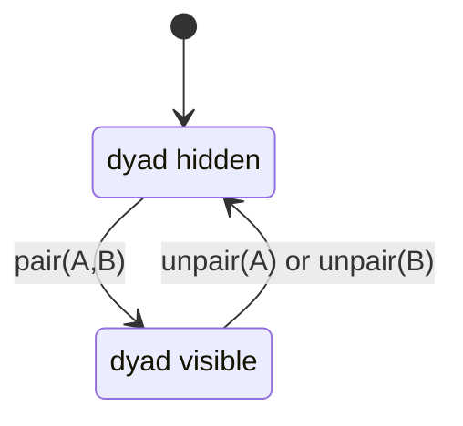

# DuoTask — Pairing.md

A concise, implementation-ready plan for **pairing** and **shared task** behavior.

---

## 1) Purpose & Scope
Ensure pairing is **exclusive, predictable, and reversible**. Shared tasks belong to the **dyad (pair)**, not to a moving “current partner”. This document defines:
- Invariants (what must always be true)
- Data model + constraints
- State machine and operations
- UI/UX rules
- API/RPC contracts
- Query patterns (client)
- Migration & QA checklist
- Monitoring & recovery

---

## 2) Non‑Negotiable Guarantees
1. A user can be in **at most one active pair** at any time.
2. **Shared tasks attach to a `pair_id`** (dyad), never to a single user.
3. **Personal tasks are owned by their creator** and never move.
4. Unpairing **hides** shared tasks (kept in DB). Re‑pairing the same dyad makes them **reappear**.
5. `creator_id` and `pair_id` on a task are **immutable**.

---

## 3) Data Model (summary)
### Tables
- **`usr`**: your user profile table (replace with your actual name, e.g., `profiles`).
- **`pair`** *(dyad, canonical)*
  - `id` (uuid pk)
  - `user_a` (uuid), `user_b` (uuid) with **order rule** `user_a < user_b`
  - `status` in {`active`, `inactive`}
  - Unique on `(user_a, user_b)` (only one row per dyad)
  - **Single‑active guard**: each user may appear in at most one `active` pair
- **`task`**
  - `id` (uuid), `title`, `due_at`, `status`, …
  - `scope` in {`personal`, `shared`}
  - `creator_id` (uuid) **immutable**
  - `owner_id` (uuid, nullable) → claim/assignment, can change
  - `pair_id` (uuid, nullable) → **required when `shared`**, **null when `personal`**
  - Soft delete `deleted_at` (optional)

### Key Constraints (expressed in words)
- **Scope ↔ pair**: `(personal ⇒ pair_id IS NULL)` and `(shared ⇒ pair_id IS NOT NULL)`
- **Task immutables**: updating `creator_id` or `pair_id` is rejected
- **No cascading reassign**: FKs use `on delete restrict` (or `set null` for `owner_id`)

> **Why no extra “created_with_userX” column?** The `pair_id` already encodes the dyad. It’s sufficient for “reappear on re‑pair”.

---

## 4) State Machine

- No half states. Unpair is immediate and symmetric.

---

## 5) Operations (server truth)
### Pair request (userX → userY)
1. **Reject** if either is already in an `active` pair (clear error).
2. If dyad `(X,Y)` exists and is `inactive`, set to `active`.
3. Else insert dyad as `active`.
4. **Do not touch tasks.** Visibility flows from pair status.

### Unpair (either side)
1. Set dyad `status = 'inactive'`.
2. **Do not touch tasks.** They remain tied to `pair_id`.
3. Notify both users.

### Re‑pair
- Flipping dyad back to `active` makes its tasks reappear. No copying, no reassignment.

### No Queues / Waitlists
- If a target is already paired, return: **“That user is already paired.”** Keep consent & expectations clear.

---

## 6) UI / UX Rules
- **Tabs**: *Personal* | *Shared*
  - **Personal composer** title: **“New Personal Task”**
  - **Shared composer** (paired): **“New Shared Task with {PartnerName}”**
  - **Shared tab when unpaired**: disable input, helper: **“Pair to create shared tasks.”**
- **Creation guards**
  - When unpaired, **do not allow** creating shared tasks (UI disabled; DB rejects if bypassed).
- **Notifications**
  - On pair success: **“Paired with {Name} 🎉”**
  - On pair failure (busy): **“That user is already paired.”**
  - On unpair (initiator): **“You unpaired from {Name}.”**
  - On unpair (other side): **“{Name} unpaired from you.”**

---

## 7) API / RPC Contracts (minimal)
- `fn_pair_up(partner_id uuid) → pair_id uuid`
  - Activates `(me, partner)` dyad, enforcing **single‑active per user** rule
  - Errors: `Invalid partner`, `One of the users is already paired`
- `fn_unpair() → void`
  - Deactivates the dyad containing `me` (if any)

> In dev, optional simulators: `fn_pair_up_sim(acting_user, partner_id)`, `fn_unpair_sim(acting_user)`.

---

## 8) Client Query Patterns
**Shared tasks for current user**
```sql
select t.*
from public.task t
join public.pair p on p.id = t.pair_id
where t.scope = 'shared'
  and p.status = 'active'
  and auth.uid() in (p.user_a, p.user_b)
order by t.created_at desc;
```

**Personal tasks for current user**
```sql
select t.*
from public.task t
where t.scope = 'personal'
  and t.creator_id = auth.uid()
order by t.created_at desc;
```

**Claim/ownership UI**: update only `owner_id` and task progress fields.

---

## 9) RLS (policy summary)
- **`pair`**
  - `select/update`: allowed if `auth.uid()` is `user_a` or `user_b`
  - `insert`: via RPC only (recommended)
- **`task`**
  - *Personal*: creator can `select/insert/update/delete`
  - *Shared*: members of the **active dyad** can `select/insert/update/delete`
  - Guard immutables: reject updates that change `creator_id` or `pair_id`

---

## 10) Migration & Backfill Plan
1. **Create `pair`** table, constraints, and triggers.
2. **Add/verify** `scope`, `creator_id`, `owner_id`, `pair_id` columns on `task`.
3. **Backfill dyads**: for each historical shared task `(uA,uB)`, create/find dyad; set `task.pair_id` accordingly. Mark dyads `inactive` unless the pair is currently paired.
4. **Enable RLS** and policies.
5. **Lock immutables**: triggers to block updates of `creator_id`/`pair_id`.
6. **Remove old code paths** that reassign/migrate tasks on (un)pair.
7. Ship, then run QA matrix below.

---

## 11) QA Test Matrix
| Case | Steps | Expected |
|---|---|---|
| Personal isolation | A creates personal | Only A sees it; unaffected by pairing |
| Pair create | Pair A↔B, A creates shared | A and B see it |
| Unpair hide | Unpair A↔B | Shared tasks remain in DB but are hidden from both |
| Re‑pair reveal | Re‑pair A↔B | Previously created A↔B tasks reappear |
| Busy target | C tries to pair with A while A↔B active | Error “That user is already paired.” |
| Shared while unpaired | Unpaired tries to create shared | UI blocked; DB rejects if attempted |
| Immutables | Try to update `creator_id`/`pair_id` | Update rejected |

---

## 12) Monitoring & Alerts
- **Invariant checks (daily cron or dashboard)**
  - Users appearing in **>1 active pair** (should be 0)
  - `tasks` where `scope='shared' AND pair_id IS NULL` (should be 0)
  - Any updates attempting to change `creator_id` / `pair_id` (log/alert)
- **Product metrics**
  - Active pairs over time
  - Shared tasks per dyad

---

## 13) Troubleshooting & Recovery
**Symptoms**: “Shared tasks moved” or “user sees unpaired but DB says paired”.

1. **Freeze** any background job/trigger that touches `creator_id`/`pair_id`.
2. **Verify dyads** for the affected users; ensure only one `active` dyad per user.
3. For each wrong task:
   - Restore original `creator_id` from audit logs
   - Set `pair_id` to the correct dyad (create if missing)
4. Ensure dyad `status` matches the real pairing. Re‑run QA tests.

---

## 14) Copy for UI (ready‑to‑paste)
- Personal composer title: **“New Personal Task”**
- Shared composer title: **“New Shared Task with {PartnerName}”**
- Shared tab disabled hint (unpaired): **“Pair to create shared tasks.”**
- Pair success: **“Paired with {Name} 🎉”**
- Pair blocked: **“That user is already paired.”**
- Unpair (initiator): **“You unpaired from {Name}.”**
- Unpair (other): **“{Name} unpaired from you.”**

---

## 15) References
- SQL migration & policies live alongside this doc: `migration.sql`, `policies.sql`, `functions.sql`, `test_sim.sql` (see repo scripts).

> **One‑pager TL;DR**: Shared tasks are bound to the **dyad**. Pairing flips the dyad **active**/**inactive**; we never move tasks. This keeps logic simple, UX clear, and history intact.

